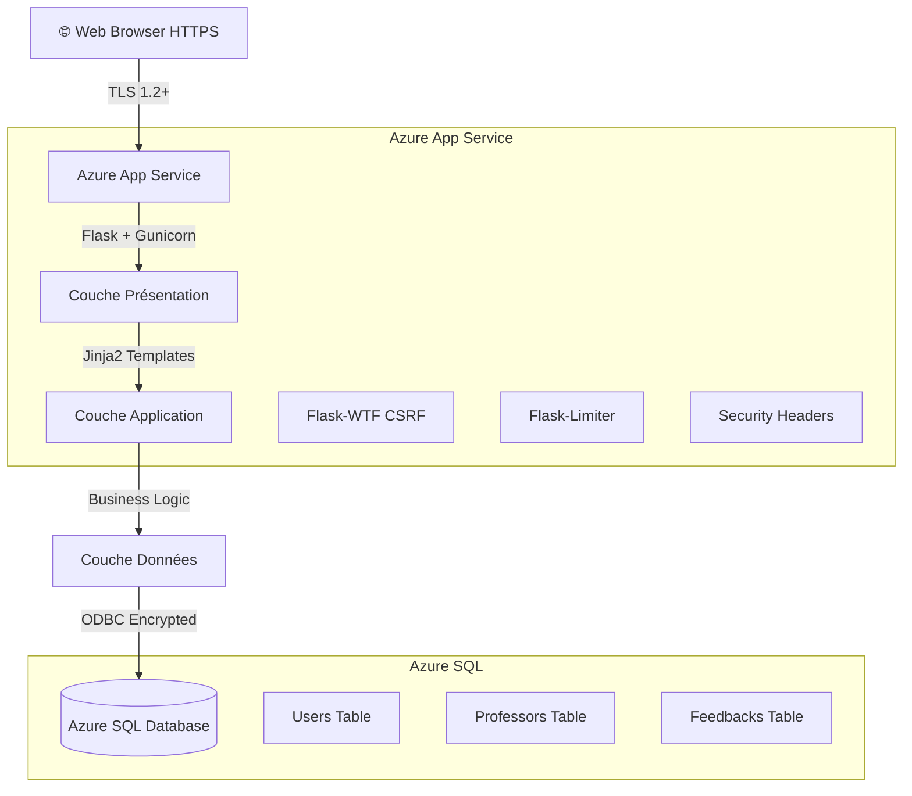
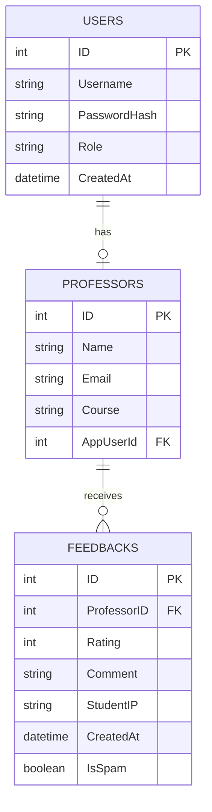

# 🎙️ CampusVoice

<div align="center">


**Plateforme sécurisée de feedback anonyme pour les universités**

*Mini-projet de Cloud Computing — Master MIATE — FPN Nador*

[📖 Vue d'ensemble](#-vue-densemble) • [🏗️ Architecture](#️-architecture) • [🔒 Sécurité](#-sécurité) • [🚀 Déploiement](#-déploiement-azure) • [👥 Équipe](#-équipe)

</div>

---

## 📋 Table des matières

- [📖 Vue d'ensemble](#-vue-densemble)
- [✨ Fonctionnalités clés](#-fonctionnalités-clés)
- [🏗️ Architecture](#️-architecture)
- [🔒 Sécurité](#-sécurité)
- [🗄️ Base de données](#️-base-de-données)
- [👥 Rôles utilisateurs](#-rôles-utilisateurs)
- [⚙️ Installation](#️-installation)
- [☁️ Déploiement Azure](#️-déploiement-azure)
- [📁 Structure du projet](#-structure-du-projet)
- [🧪 Tests](#-tests)
- [🗺️ Roadmap](#️-roadmap)
- [👨‍🎓 Équipe](#-équipe)
- [📜 Licence](#-licence)

---

## 📖 Vue d'ensemble

**CampusVoice** est une plateforme web sécurisée permettant aux étudiants de soumettre des **évaluations anonymes** de leurs cours et professeurs. Elle offre aux enseignants et administrateurs un **tableau de bord protégé** avec des analyses exploitables.

> 💡 **Objectif** : Briser la barrière de la peur en offrant un canal de feedback 100% anonyme, tout en garantissant la sécurité, la traçabilité et la scalabilité via le cloud Microsoft Azure.

### 🎯 Problématique résolue

| Problème | Solution CampusVoice |
| :--- | :--- |
| 😰 Les étudiants n'osent pas donner un feedback honnête | ✅ Soumission **100% anonyme**, sans compte |
| 📊 Les professeurs n'ont pas de vue claire des retours | ✅ Dashboard avec filtres, statistiques et export CSV |
| 🔓 Risques de spam et d'abus | ✅ Rate limiting + 1 feedback/prof/jour/IP |
| ☁️ Déploiement complexe | ✅ Architecture PaaS sur Azure (App Service + SQL) |

---

## ✨ Fonctionnalités clés

| Catégorie | Description |
| :--- | :--- |
| 🕵️ **Anonymat total** | Soumission sans compte, sans tracking, sans cookies |
| 🔐 **RBAC** | Contrôle d'accès basé sur les rôles (Étudiant / Prof / Admin) |
| 📊 **Dashboard temps réel** | Filtrage, statistiques et export CSV des feedbacks |
| 🛡️ **Sécurité renforcée** | CSRF, rate limiting, headers sécurisés, sessions HttpOnly |
| ☁️ **Cloud-Native** | Déployé sur Azure App Service + Azure SQL Database |
| 📤 **Export CSV** | Analyse facile dans Excel / Google Sheets |
| ⏱️ **Anti-spam** | Limitation à 1 feedback par professeur par jour par IP |

---

## 🏗️ Architecture

### Diagramme d'architecture



### Architecture 3-Tiers

| Couche | Technologie | Rôle |
| :--- | :--- | :--- |
| 🎨 **Présentation** | Flask + Jinja2 | Interface utilisateur, templates HTML/CSS |
| ⚙️ **Application** | Flask + Gunicorn | Logique métier, authentification, rate limiting |
| 💾 **Données** | Azure SQL Database | Stockage persistant, connexions chiffrées |

----

## 🔒 Sécurité

### Mécanismes de défense

| Fonctionnalité | Objectif | Technologie |
| :--- | :--- | :--- |
| 🛡️ **CSRF Protection** | Empêcher les requêtes cross-site | Flask-WTF |
| ⏱️ **Rate Limiting** | Bloquer brute-force & spam | Flask-Limiter (5 tentatives / 60s) |
| 🚫 **Anti-Spam** | 1 feedback/prof/jour/IP | Logique personnalisée |
| 🔐 **Secure Headers** | Protection XSS, clickjacking, MIME | CSP, HSTS, X-Frame-Options |
| 🍪 **Session Security** | Cookies sécurisés | HttpOnly + Secure + SameSite |
| 🧼 **Input Sanitization** | Prévention XSS | `markupsafe.escape()` |

### Sécurité au niveau Azure

- ✅ **TLS 1.2+** pour toutes les communications
- ✅ **SQL Firewall** — Seul l'App Service peut se connecter
- ✅ **Credentials chiffrés** — Variables d'environnement (pas de secrets dans le code)
- ✅ **Isolation réseau** — Private endpoints disponibles en production

### Authentification par rôle

| Rôle | Authentification | Accès |
| :--- | :--- | :--- |
| 👨‍🎓 **Étudiant** | ❌ Aucune (anonymat) | Soumission de feedback uniquement |
| 👨‍🏫 **Professeur** | ✅ Username + Password | Dashboard de ses feedbacks uniquement |
| 👨‍💼 **Admin** | ✅ Username + Password | Accès global à toutes les données |

---

## 🗄️ Base de données

### Schéma relationnel



---

## 👥 Rôles utilisateurs

### 🕵️ Étudiant (Anonyme)
1. Visite la page d'accueil
2. Accepte la notice de confidentialité
3. Sélectionne un professeur/cours
4. Note (1-5 étoiles) + commentaire
5. Soumet le feedback
6. **Aucun compte, aucun tracking**

### 👨‍🏫 Professeur (Authentifié)
1. Connexion avec identifiants
2. Dashboard avec **ses feedbacks uniquement**
3. Filtrage par date, note, cours
4. Export CSV des données
5. Visualisation des moyennes et suggestions
6. **Ne peut pas voir les feedbacks des autres professeurs**

### 👨‍💼 Admin / Coordinateur (Authentifié)
1. Connexion avec identifiants
2. Dashboard global (tous les feedbacks)
3. Filtrage avancé et analytique
4. Gestion des professeurs (ajout/suppression)
5. Export et reporting système
6. **Accès complet à toutes les données**

---

## ⚙️ Installation

### 📋 Prérequis

- 🐍 Python 3.9+
- 🗄️ Azure SQL Database (ou SQL Server local)
- 🔌 ODBC Driver 18 pour SQL Server
- 📦 pip (gestionnaire de paquets Python)

### 🚀 Installation locale

**1. Cloner le dépôt**
```bash
git clone https://github.com/boujaadamohammed/campusvoice.git
cd campusvoice
```

**2. Créer un environnement virtuel**
```bash
python -m venv venv
source venv/bin/activate        # Linux/macOS
venv\Scripts\activate           # Windows
```

**3. Installer les dépendances**
```bash
pip install -r requirements.txt
```

**4. Configurer les variables d'environnement**
```bash
cp .env.example .env
# Éditer .env avec vos credentials Azure SQL
```

**5. Installer le driver ODBC** (si nécessaire)
```bash
# Ubuntu/Debian:
sudo apt-get install odbc-msodbcsql18

# macOS:
brew install msodbcsql18

# Windows: Télécharger depuis Microsoft
```

**6. Lancer l'application**
```bash
# Mode développement
flask run

# Mode production
gunicorn -w 4 -b 0.0.0.0:8000 app:app
```

🌐 Accédez à : `http://localhost:5000`

### 🔧 Variables d'environnement

Créez un fichier `.env` à la racine :

```bash
# Flask Configuration
FLASK_ENV=production
SECRET_KEY=your-super-secret-key-change-this

# Azure SQL Database
DB_SERVER=your-server.database.windows.net
DB_USER=your-sql-username
DB_PASSWORD=your-sql-password
DB_NAME=campusvoice_db

# Security Settings
SESSION_TIMEOUT=1800           # 30 minutes
MAX_LOGIN_ATTEMPTS=5           # Max tentatives de login
RATE_LIMIT_WINDOW=60           # Fenêtre en secondes
```

> ⚠️ **NE JAMAIS committer `.env` dans le version control !**

---

## ☁️ Déploiement Azure

### Option 1 : Azure CLI (Recommandé)

```bash
az login
az group create --name campusvoice-rg --location eastus
az appservice plan create --name campusvoice-plan \
    --resource-group campusvoice-rg --sku B1 --is-linux
az webapp create --resource-group campusvoice-rg \
    --plan campusvoice-plan --name campusvoice-app \
    --runtime "PYTHON|3.11"
az webapp config appsettings set \
    --resource-group campusvoice-rg --name campusvoice-app \
    --settings @settings.json
az webapp up --resource-group campusvoice-rg --name campusvoice-app
```

### Option 2 : Azure Portal
1. Créer un **App Service** (Python 3.11)
2. Créer une **Azure SQL Database**
3. Uploader le code via Git/ZIP
4. Configurer les variables d'environnement
5. Configurer les règles firewall SQL

### Option 3 : GitHub Actions (CI/CD)
Déploiement automatique à chaque push via `.github/workflows/deploy.yml`

---

## 📁 Structure du projet

```text
campusvoice/
│
├── app.py                      # Application Flask principale
├── requirements.txt            # Dépendances Python
├── .env.example               # Template des variables d'environnement
├── .gitignore                 # Fichiers ignorés par Git
├── Procfile                   # Configuration de déploiement
│
├── static/                    # Ressources statiques
│   ├── style.css              # Styles CSS
│   
│
├── templates/                 # Templates Jinja2
│   ├── index.html             # Page d'accueil
│   ├── login.html             # Page de connexion
│   ├── dashboard.html         # Dashboard Admin/Prof
│   ├── feedback-form.html     # Formulaire de feedback anonyme
│   └── base.html              # Template de base
│
├── deployments/               # Configurations Azure
│   ├── azure-deploy.sh        # Script de déploiement
│   └── README_AZURE.md        # Guide Azure
│
└── docs/                      # Documentation
    ├── architecture.md        # Architecture technique
    └── security.md            # Documentation sécurité
```

---

## 🧪 Tests

### Tester la connexion à la base de données
```bash
# Visitez : http://localhost:5000/test-db
# Doit retourner le statut de connexion et le nombre de tables
```

### Tester le Rate Limiting
```bash
# Tentez plusieurs connexions rapides - doit être bloqué après 5 tentatives
```

### Tester la protection CSRF
```bash
# Tentez de soumettre un formulaire sans token CSRF - doit échouer
```

---

## 🗺️ Roadmap

### ✅ Implémenté
- [x] Architecture 3-tiers Flask + Azure SQL
- [x] Système d'anonymat pour les étudiants
- [x] Dashboard avec filtres et export CSV
- [x] Protection CSRF et rate limiting
- [x] Déploiement sur Azure App Service

### 🚧 En cours / À venir
- [ ] 🔐 Remplacer MD5 par **bcrypt/Argon2**
- [ ] 🔑 Intégrer **Azure Key Vault** pour les secrets
- [ ] 🆔 Intégrer **Microsoft Entra ID** (SSO)
- [ ] 📱 **Multi-Factor Authentication** (MFA)
- [ ] 📊 Dashboard analytique avec **Chart.js / D3.js**
- [ ] 📱 Application mobile **React Native**
- [ ] 🔔 Notifications en temps réel
- [ ] 📄 Génération de rapports **PDF**
- [ ] 🧠 **Analyse de sentiment** sur les commentaires
- [ ] 🤖 Détection de spam par **Machine Learning**

---

## 👨‍🎓 Équipe

<div align="center">

<table>
  <tr>
    <td align="center">
      <a href="https://github.com/mohammed-boujaada">
        
        <br/>
        <sub><b>Mohammed Boujaada</b></sub>
      </a>
      <br/>
      🎓 Master MIATE — FPN Nador
      <br/>
      <a href="https://github.com/mohammed-boujaada">
        
      </a>
      <a href="https://www.linkedin.com/in/mohammed-boujaada/">
        
      </a>
    </td>
    <td align="center">
      <a href="https://github.com/moza369">
        
        <br/>
        <sub><b>Mohamed Zahir</b></sub>
      </a>
      <br/>
      🎓 Master MIATE — FPN Nador
      <br/>
      <a href="https://github.com/moza369">
        
      </a>
    </td>
  </tr>
</table>

</div>

**🏫 Institution** : FPN Nador — Master Intelligence Artificielle & Technologies Émergentes  
**📚 Module** : Cloud Computing  
**📅 Année** : 2025 - 2026

</div>

---

## 📜 Licence

Ce projet est fourni **tel quel** à des fins éducatives.  
Libre d'utilisation, de modification et de partage dans un cadre académique.

---

## 🙏 Remerciements

- ☁️ **Microsoft Azure** — Crédit étudiant de 100$ pour l'infrastructure cloud
- 🌶️ **Flask** — Framework web léger et performant
- 🏫 **FPN Nador** — Encadrement pédagogique et exigences du projet
- 👥 Tous les contributeurs et testeurs

---

## 📖 Citation

```bibtex
@misc{boujaada2026campusvoice,
  author = {Boujaada Mohammed and Zahir Mohamed},
  title = {CampusVoice: Anonymous University Feedback Platform on Azure},
  year = {2026},
  publisher = {GitHub},
  journal = {GitHub repository},
  howpublished = {\url{https://github.com/boujaadamohammed/campusvoice}}
}
```

---

<div align="center">

### ⭐ Si ce projet vous inspire, n'hésitez pas à lui donner une étoile !

**Développé avec ❤️ par Mohammed Boujaada & Mohamed Zahir**

*Projet académique — Master MIATE — FPN Nador — 2026*

</div>
